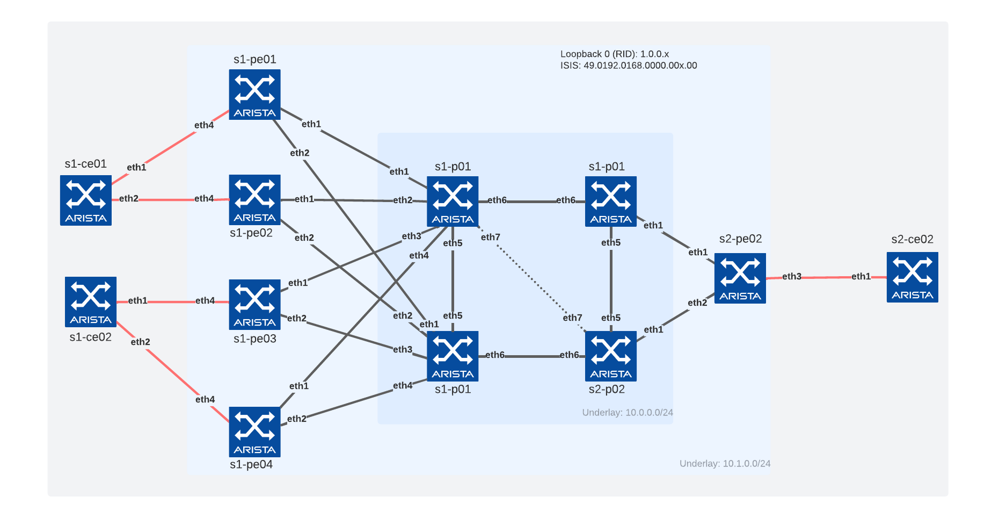

# ISIS-SR & MPLS Backbone

## Overview

Lab for MPLS and ISIS-SR related to customer engagement based on containerlab and cEOS.

## Topology


```bash
+----+-------------------------------+---------------------+------+---------+------------------+
| #  |           Name                |        Image        | Kind |  Id     |   IPv4 Address   |
+----+-------------------------------+---------------------+------+---------+------------------+
|  1 | clab-atd-mpls-isis-sr-s1-ce01 | arista/ceos:4.31.0F | ceos | 211     | 192.168.2.211/24 |
|  2 | clab-atd-mpls-isis-sr-s1-ce02 | arista/ceos:4.31.0F | ceos | 212     | 192.168.2.212/24 |
|  3 | clab-atd-mpls-isis-sr-s1-p01  | arista/ceos:4.31.0F | ceos | 111     | 192.168.2.111/24 |
|  4 | clab-atd-mpls-isis-sr-s1-p02  | arista/ceos:4.31.0F | ceos | 112     | 192.168.2.112/24 |
|  5 | clab-atd-mpls-isis-sr-s1-pe01 | arista/ceos:4.31.0F | ceos | 11      | 192.168.2.11/24  |
|  6 | clab-atd-mpls-isis-sr-s1-pe02 | arista/ceos:4.31.0F | ceos | 12      | 192.168.2.12/24  |
|  7 | clab-atd-mpls-isis-sr-s1-pe03 | arista/ceos:4.31.0F | ceos | 13      | 192.168.2.13/24  |
|  8 | clab-atd-mpls-isis-sr-s1-pe04 | arista/ceos:4.31.0F | ceos | 14      | 192.168.2.14/24  |
|  9 | clab-atd-mpls-isis-sr-s2-ce01 | arista/ceos:4.31.0F | ceos | 221     | 192.168.2.221/24 |
| 10 | clab-atd-mpls-isis-sr-s2-p01  | arista/ceos:4.31.0F | ceos | 121     | 192.168.2.121/24 |
| 11 | clab-atd-mpls-isis-sr-s2-p02  | arista/ceos:4.31.0F | ceos | 122     | 192.168.2.122/24 |
| 12 | clab-atd-mpls-isis-sr-s2-pe01 | arista/ceos:4.31.0F | ceos | 21      | 192.168.2.21/24  |
+----+-------------------------------+---------------------+------+---------+------------------+
```



Detailed information available under [`config-builder`](./config-builder/)

### Credentials

- Username: arista
- Password: arista

## Commands

### Get cEOS

```bash
ardl get eos --image-type cEOS --version 4.31.0F --import-docker
```

> eos-downloader configuration is availble in [this repo](https://github.com/titom73/eos-downloader)

### Create Topology

```bash
sudo containerlab deploy --reconfigure
```

To start topology with a specific version:

```bash
EOS_VERSION=<your eos version>; sudo containerlab deploy --reconfigure
```

### Save running configuration

```bash
sudo containerlab save
```

### Configuration management

Lab is built with Arista AVD role using ansible. Variables are all configured under [`config-builder`](./config-builder/) folder

```bash
# Build configuration
ansible-playbook playbooks/config-management.yml --tags build

# Push configuration
ansible-playbook playbooks/config-management.yml --tags deploy

# Build and Push
ansible-playbook playbooks/config-management.yml --tags build,deploy
```

### Capture commands

To capture commands outputs, we use ANTA

```bash
# If direnv not installed
source .envrc

# Capture commands for core devices
anta exec snapshot -o anta/<name of your snapshot> -c anta/snapshot-core.yml -t core

# Capture commands for edge devices
anta exec snapshot -o anta/<name of your snapshot> -c anta/snapshot-edge.yml -t edge

# Capture commands for access devices
anta exec snapshot -o anta/<name of your snapshot> -c anta/snapshot-access.yml -t access
```
