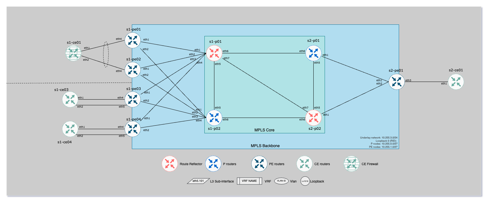

# ISIS-SR & MPLS Backbone

## Overview

Lab for MPLS and ISIS-SR related configurations based on containerlab and cEOS.

## Topology


```bash
+----+-------------------------------+---------------------+------+------------------+
| #  |             Name              |        Image        | Kind |   IPv4 Address   |
+----+-------------------------------+---------------------+------+------------------+
|  1 | clab-atd-mpls-isis-sr-s1-ce01 | arista/ceos:4.31.0F | ceos | 192.168.2.211/24 |
|  2 | clab-atd-mpls-isis-sr-s1-ce02 | arista/ceos:4.31.0F | ceos | 192.168.2.212/24 |
|  3 | clab-atd-mpls-isis-sr-s1-ce03 | arista/ceos:4.31.0F | ceos | 192.168.2.213/24 |
|  4 | clab-atd-mpls-isis-sr-s1-p01  | arista/ceos:4.31.0F | ceos | 192.168.2.111/24 |
|  5 | clab-atd-mpls-isis-sr-s1-p02  | arista/ceos:4.31.0F | ceos | 192.168.2.112/24 |
|  6 | clab-atd-mpls-isis-sr-s1-pe01 | arista/ceos:4.31.0F | ceos | 192.168.2.11/24  |
|  7 | clab-atd-mpls-isis-sr-s1-pe02 | arista/ceos:4.31.0F | ceos | 192.168.2.12/24  |
|  8 | clab-atd-mpls-isis-sr-s1-pe03 | arista/ceos:4.31.0F | ceos | 192.168.2.13/24  |
|  9 | clab-atd-mpls-isis-sr-s1-pe04 | arista/ceos:4.31.0F | ceos | 192.168.2.14/24  |
| 10 | clab-atd-mpls-isis-sr-s2-ce01 | arista/ceos:4.31.0F | ceos | 192.168.2.221/24 |
| 11 | clab-atd-mpls-isis-sr-s2-p01  | arista/ceos:4.31.0F | ceos | 192.168.2.121/24 |
| 12 | clab-atd-mpls-isis-sr-s2-p02  | arista/ceos:4.31.0F | ceos | 192.168.2.122/24 |
| 13 | clab-atd-mpls-isis-sr-s2-pe01 | arista/ceos:4.31.0F | ceos | 192.168.2.21/24  |
+----+-------------------------------+---------------------+------+------------------+
```



Detailed information available under [`config-builder`](./config-builder/)

### Labs

- [EVPN with IRB](docs/evpn-irb.md)
- [EVPN L3VPN](docs/l3vpn.md)
- [EVPN with BGP as CE to PE and Firewall Cluster](docs/pe-to-ce-bgp-firewall.md)
- [Pseudowire & VPWS](./docs/vpws.md)

### Credentials

- User: admin (no password)
- User: arista (password: arista)

## Commands

### Get cEOS

```bash
ardl get eos --image-type cEOS --version 4.31.0F --import-docker
```

> eos-downloader configuration is availble in [this repo](https://github.com/titom73/eos-downloader)

### Start Topology

```bash
sudo containerlab deploy --reconfigure
```

To start topology with a specific version:

```bash
EOS_VERSION=<your eos version>; sudo containerlab deploy --reconfigure
```

### Start a subset of the topology

Makefile gives options to start only few routers to run a subset of the backbone and limit host resources.

- `base`       Load a base part of the lab - `s1-pe03, s1-pe04, s1-p01, s1-p02, s1-ce03, s1-ce04`
- `small-mh`   Load a base part of the lab. Multi homed devices oriented - `s1-pe03, s1-pe01, s1-pe02, s1-p01, s1-ce01, s1-ce03`
- `small-sh`   Load a base part of the lab. Single homed devices oriented - `s1-pe03, s1-pe04, s1-p01, s1-ce03, s1-ce04`
- `l3vpn`:     Load a base part of the lab to support L3VPN labs - `s1-pe03, s1-pe01, s1-pe02, s1-p01, s1-ce01, s1-ce03, s2-p01, s2-pe01, s2-ce01`

### Configuration management

Lab is built with Arista AVD role using ansible. Variables are all configured under [`config-builder`](./config-builder/) folder

```bash
# Build configuration
ansible-playbook playbooks/config-management.yml --tags build

# Push configuration
ansible-playbook playbooks/config-management.yml --tags deploy

# Build and Push
ansible-playbook playbooks/config-management.yml --tags build,deploy
```

### Setup environment

In a virtual environment, run the following for avd runs:

```bash
# Install python requirements
pip install -r requirements.txt

# Install avd collection
ansible-galaxy collection install -r collections.yml
```

Install containelab:

```bash
bash -c "$(curl -sL https://get.containerlab.dev)"
```

> [!WARNING]
> For MacOS installation, please refer to containerlab [website](https://containerlab.dev/install/)
