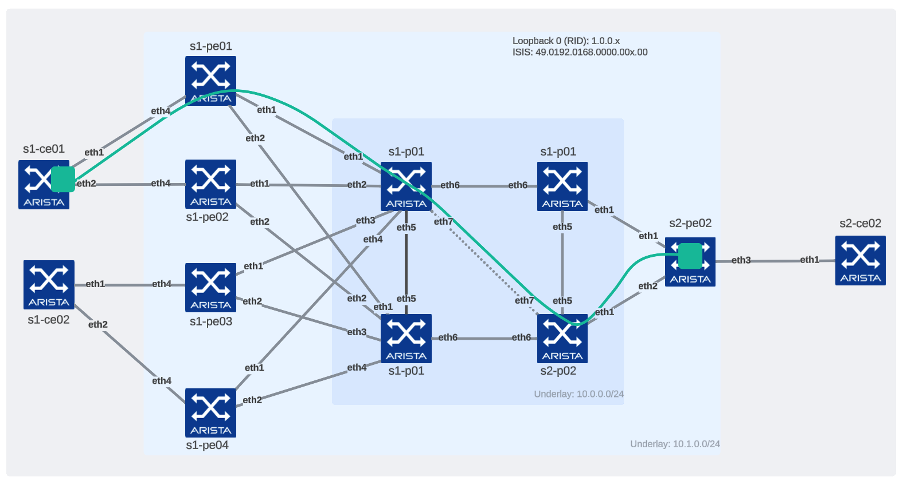

# Topology information

## Core information:

- Management network: `192.168.2.0/24 eq 32`

- Underlay point to point:
  - P to P links: `10.0.0.0/24 eq 31`
  - PE to P on site 1: `10.0.1.0/24 eq 31`
  - PE to P on site 2: `10.0.2.0/24 eq 31`

- Loopback0 subnets:
  - IPv4: `1.0.0.0/24 eq 32`
  - ISIS: `49.0192.0168.0000.0{{ rid.split('.')[3] }}.00`

- Segment Routing IDs:
  - Device: `900{device-id}`
  - Link: `9500{link-id}` (cf [pre-allocated details](#pre-allocated-sid-for-links))

## PE device standard connectivity

|Interface Name| Destination | Description |
|--------------|-------------|-------------|
| Ethernet 1 | NNI | core interface |
| Ethernet 2 | NNI | core interface |
| Ethernet 4 | UNI | ESI on site 01 PEs / Single interface on site 02 PE Use case: __CLIENT__, __BKP__ |

## Pre-configured services:

- VRF: __FW-HA__
  - Description: Firewall connectivity use case
  - route-target: `1:1`
  - redistribute:
      - `connected`
      - `static`
  - Vlan SVI:
      - ID: `1810` / Subnet: `10.18.10.0/24`
  - Loopback:
    - ID: `1810` / Subnet: `1.18.10.0/24 eq 32`

- VRF: __BKP__
  - Description: BKP Use case with link coloring for traffic-engineering policies
  - route-target: `1:2`
  - redistribute:
      - `connected`
      - `static`
  - Vlan SVI:
      - ID: `2001` / Subnet: `10.200.1.0/24`
      - ID: `2002` / Subnet: `10.200.2.0/24`

### VLANS

- Vlan: `1810`
  - Description: Provides L2 extensions between S1-PE nodes for Firewall failover and VRRP.
  - route-target: `1810:1810`
  - redistribute_routes:
      - `learned`
      - `router-mac system default-gateway`
- Vlan: `2001`
  - Description: Backup service seated in S1 (no EVPN extension)
  - SVI mapped to __BKP__ VRF
- Vlan: `2002`
  - Description: Backup service seated in S2 (no EVPN extension)
  - SVI mapped to __BKP__ VRF

## Ethernet Segments

- ESI: `0000:0000:0101:0101:0101`
  - Members:
    - `s1-pe01` - `eth4 / po4`
    - `s1-pe02` - `eth4 / po4`

- ESI: `0000:0000:0101:0101:0202`
  - Members:
    - `s2-pe01` - `eth4 / po4`
    - `s2-pe02` - `eth4 / po4`

## Traffic Policies

| Color | PE Src | PE dst | Path |
|-------|--------|--------|------|
| 300 | `s1-pe01` | `s2-pe01` | via `s1-p01` -> `s2-p02` -> `s2-pe01` |

## Pre Allocated SID for links

This SID allocation is here to allow to map colors on specific path if required. For the moment, it is not used in default topology.

sid is based on concatenation of `9+index`:

- S1 PE to P
  - Prefix:"10.0.1.0/31" - index: `50010`
  - Prefix:"10.0.1.2/31" - index: `50012`
  - Prefix:"10.0.1.4/31" - index: `50014`
  - Prefix:"10.0.1.6/31" - index: `50016`
  - Prefix:"10.0.1.8/31" - index: `50018`
  - Prefix:"10.0.1.10/31" - index: `50100`
  - Prefix:"10.0.1.12/31" - index: `50112`
  - Prefix:"10.0.1.14/31" - index: `50114`
- P to P
  - Prefix:"10.0.0.0/31" - index: `50000`
  - Prefix:"10.0.0.2/31" - index: `50002`
  - Prefix:"10.0.0.4/31" - index: `50004`
  - Prefix:"10.0.0.6/31" - index: `50006`
  - Prefix:"10.0.0.8/31" - index: `50008`
- S1 PE to P
  - Prefix:"10.0.2.0/31" - index: `50020`
  - Prefix:"10.0.2.2/31" - index: `50022`