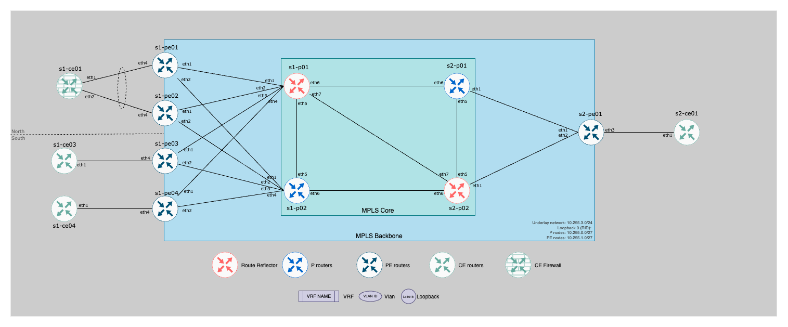

# Topology information

## Username and password

| Username   | Password    | Allow in ssh |
|------------|-------------|--------------|
| `admin`    |  nopassword | True         |
| `ansible`  |  `ansible`  | True         |

## Core information

- Management:
  - Management network: `192.168.2.0/24 eq 32`
  - Management gateway: `192.168.2.1`

- Underlay:
  - Backbone ASN: __`65000`__
  - Underlay point to point: `10.255.3.0/24 eq 31`
  - Loopback0 subnets:
    - IPv4:
      - P Nodes: `10.255.0.0/27 eq 32`
      - PE Nodes: `10.255.1.0/27 eq 32`
    - ISIS: `49.0001.0102.5500.1001.00`

> [!TIP]
> Fabric and IPAM documentation available [here](documentation/fabric/backbone-documentation.md)

## Device information

Full device documentation available [here](documentation/devices/)

## Pre-configured services

- [EVPN with IRB](../docs/evpn-irb.md)
- [L3VPN with EVPN](../docs/l3vpn.md)
