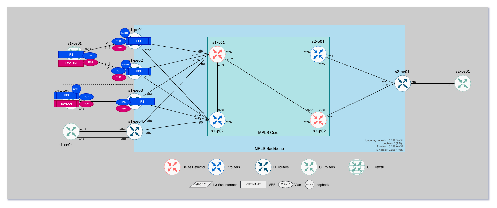

# EVPN with IRB Model Use case

## Overview

This lab covers a L3VPN based on EVPN control-plane:

- Trunk link between __s1-ce03__ and __s1-pe03__ to carry vlan `1103`
- Ethernet Segment to dual attached __s1-ce01__ to both __s1-pe01__ and __s1-pe02__ to carry vlan `1101` on trunk interface.
- Ethernet Segement is based on A/A model.



## Technical details

### Connectivity

#### Standard Ethernet Segment connectivity with IRB

| CE node | CE interface   | IP address     | IP address    | PE interface   | PE node  |
|---------|----------------|----------------|---------------|----------------|----------|
|s1-ce03  | Vlan1103       | `10.1.3.13/24` | `10.1.3.1/24` | Vlan1103       | s1-pe03  |
|s1-ce01  | Vlan1101       | `10.1.1.11/24` | `10.1.1.1/24` | Vlan1101       | s2-pe01  |
|s1-ce01  | Vlan1101       | `10.1.1.11/24` | `10.1.1.1/24` | Vlan1101       | s2-pe02  |

#### Standard Ethernet Segment connectivity with L2VLAN

| CE node | CE interface   | IP address     | IP address    | PE interface   | PE node  |
|---------|----------------|----------------|---------------|----------------|----------|
|s1-ce03  | Vlan1103       | `10.1.99.13/24` | `N/A`        | Vlan1199       | s1-pe03  |
|s1-ce01  | Vlan1101       | `10.1.99.11/24` | `N/A`        | Vlan1199       | s2-pe01  |
|s1-ce01  | Vlan1101       | `10.1.99.11/24` | `N/A`        | Vlan1199       | s2-pe02  |

### Configuration information

- VRF ID: `11`
- Tenant supernet: `10.1.0.0/16`
- Ethernet Segment:
    - ESI: 0000:0000:0101:0101:0101
        - s1-pe01 - Ethernet4
        - s1-pe02 - Ethernet4

## Snapshot

```bash
# ANTA to capture information
$ anta exec snapshot -o anta/evpn-irb -c anta/snapshot-evpn-irb.yml --tags core
```

