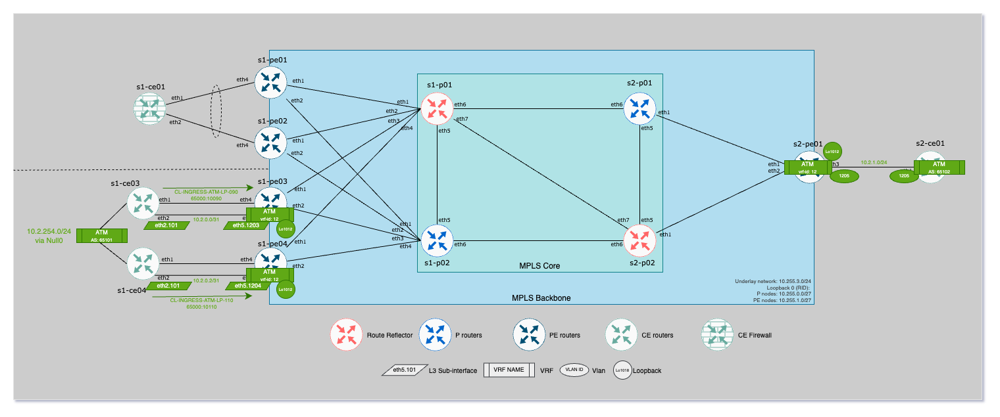

# L3VPN Use case

## Overview

This lab covers a L3VPN based on EVPN control-plane:

- Sub-interface to connect to `s1-ce03`
- Sub-interface to connect to `s1-ce04`
- `s1-ce03` and `s1-ce04` are both connected to the same network __`ASN 65101`__.
- `s2-ce01` is connected based on a SVI interface with BGP session.




## Technical details

### Connectivity

| CE node | CE interface   | IP address    | IP address    | PE interface   | PE node  |
|---------|----------------|---------------|---------------|----------------|----------|
|s1-ce03  | Ethernet2.1203 | `10.2.0.1/31` | `10.2.0.0/31` | Ethernet5.1203 | s1-pe03  |
|s1-ce04  | Ethernet2.1203 | `10.2.0.3/31` | `10.2.0.2/31` | Ethernet5.1203 | s1-pe04  |
|s2-ce01  | Vlan1205       | `10.2.1.21/24`| `10.2.1.1/24` | Vlan1205       | s2-pe01  |

### Routing Policy

| Community      |  Action                 |
|--------------  |-------------------------|
| `65000: 10110` | `local-preference 110`  |
| `65000: 10090` | `local-preference 90`   |

### Configuration information

- VRF ID: `12`
- Tenant supernet: `10.2.0.0/16`
- Announced prefix: `10.2.254.0/24`
    - route-map s1-ce03: `set community 65000:10090`
    - route-map s1-ce04: `set community 65000:10110`

## Snapshot

```bash
# ANTA to capture information
$ anta exec snapshot -o anta/l3vpn -c anta/snapshot-core-l3vpn.yml --tags core
```

## Lab Scenario

### Dual homed network with local-preference

Local Preference is updated with a route-map in at EVPN peers level according communities set on s1-ce*.

```eos
admin@s2-pe01# show bgp neighbors 10.255.0.1 evpn received-routes route-type ip-prefix 10.2.254.0/24

BGP routing table information for VRF default
Router identifier 10.255.1.5, local AS number 65000
BGP routing table entry for ip-prefix 10.2.254.0/24, Route Distinguisher: 10.255.1.3:12
 Paths: 1 available
  65101
    10.255.1.3 from 10.255.0.1 (10.255.0.1)
      Origin INCOMPLETE, metric -, localpref 90, weight 0, tag 0, valid, internal, best
      Originator: 10.255.1.3, Cluster list: 10.255.0.1
      Community: 65000:10090
      Extended Community: Route-Target-AS:12:12 TunnelEncap:tunnelTypeMpls
      MPLS label: 116385
BGP routing table entry for ip-prefix 10.2.254.0/24, Route Distinguisher: 10.255.1.4:12
 Paths: 1 available
  65101
    10.255.1.4 from 10.255.0.1 (10.255.0.1)
      Origin INCOMPLETE, metric -, localpref 110, weight 0, tag 0, valid, internal, best
      Originator: 10.255.1.4, Cluster list: 10.255.0.1
      Community: 65000:10110
      Extended Community: Route-Target-AS:12:12 TunnelEncap:tunnelTypeMpls
      MPLS label: 100001
```