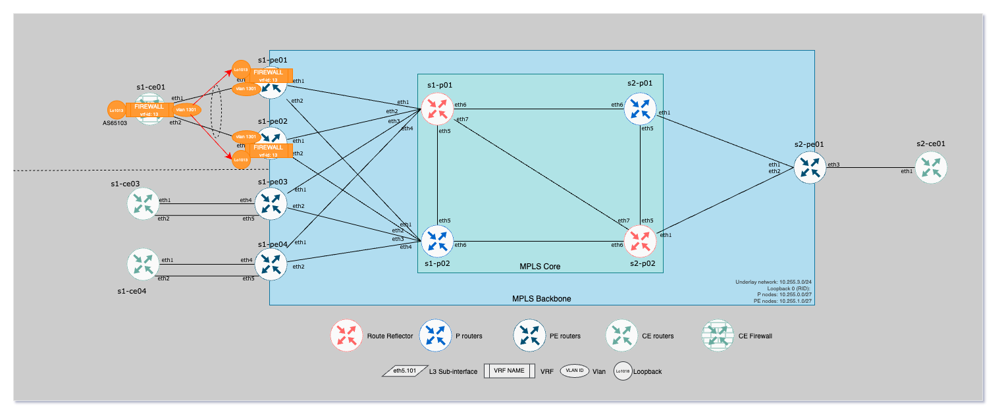

## Overview

Connect a cluster of firewall to an EVPN Fabric (MPLS) using BGP and seamless firewall failover.




- CE to PE vlan: `1301 / 10.3.1.0/24`
- PE Loopback for BGP session with Firewall: `Loopback1013 / 10.3.255.0/24`

### Configuration Snippets

#### Configuration on PE side

```eos
interface Loopback1013
   description SVC_FIREWALL_LOOPBACK
   no shutdown
   vrf FW
   ip address 10.3.255.1/32
   hardware forwarding id
!
interface Vlan1301
   description FIREWALL-BGP-EXIT-S1-NORTH
   no shutdown
   vrf FW
   ip address 10.3.1.2/24
   ip virtual-router address 10.3.1.1
!
router bgp 65000
   vlan 1301
      rd 10.255.1.1:14301
      route-target both 14301:14301
      redistribute learned
      redistribute router-mac system default-gateway
   !
   vrf FW
      rd 10.255.1.1:13
      route-target import evpn 13:13
      route-target export evpn 13:13
      router-id 10.255.1.1
      neighbor 10.3.1.11 remote-as 65103
      neighbor 10.3.1.11 update-source Loopback1013
      neighbor 10.3.1.11 description FIREWALL-BGP S1-CE01
      neighbor 10.3.1.11 ebgp-multihop 10
      neighbor 10.3.1.11 send-community standard extended
      redistribute connected
      !
      address-family ipv4
         neighbor 10.3.1.11 activate
   !
```

> [!NOTE]
> Look at following mandatory knobs:
> - `redistribute router-mac system default-gateway` case 509852
> - `hardware forwarding id` to keep loopback UP even if all physical/vlan interfaces are down
>

#### Configuration on CE side

```eos
vlan 1301
   name FIREWALL-BGP-EXIT-S1-NORTH
!
vrf instance FW
!
interface Vlan1301
   description vrf-irb-vlan1301
   no shutdown
   vrf FW
   ip address 10.3.1.11/24
!
ip routing vrf FW
!
ip route vrf FW 10.3.255.0/24 10.3.1.1
!
router bgp 65103
   router-id 10.255.1.11
   bgp default ipv4-unicast
   maximum-paths 4 ecmp 4
   neighbor MPLS-BACKBONE-FW-VRF peer group
   neighbor MPLS-BACKBONE-FW-VRF remote-as 65000
   neighbor MPLS-BACKBONE-FW-VRF bfd
   neighbor MPLS-BACKBONE-FW-VRF ebgp-multihop 10
   neighbor MPLS-BACKBONE-FW-VRF send-community
   neighbor MPLS-BACKBONE-FW-VRF maximum-routes 0
   !
   vrf FW
      neighbor 10.3.255.1 peer group MPLS-BACKBONE-FW-VRF
      neighbor 10.3.255.1 description s1-pe01-Loopback1013
      neighbor 10.3.255.2 peer group MPLS-BACKBONE-FW-VRF
      neighbor 10.3.255.2 description s1-pe02-Loopback1013
      redistribute connected
!
```

### AVD configuration

#### Service definition

```yaml
tenants:
  - name: FIREWALL
    mac_vrf_vni_base: 13000
    vrfs:
      - name: 'FW'
        vrf_id: 13
        address_families:
          - evpn
        vtep_diagnostic:
          loopback: 1013
          loopback_description: SVC_FIREWALL_LOOPBACK
          loopback_ip_range: 10.3.255.0/24
        svis:
          - id: 1301
            name: FIREWALL-BGP-EXIT-S1-NORTH
            enabled: True
            ip_virtual_router_addresses:
              - 10.3.1.1
            nodes:
              - node: s1-pe01
                ip_address: 10.3.1.2/24
              - node: s1-pe02
                ip_address: 10.3.1.3/24
            tags: ['node01', 'node02']
        bgp_peers:
          - ip_address: 10.3.1.11
            remote_as: 65103
            update_source: Loopback1013
            peer_group: FIREWALL-BGP
            description: FIREWALL-BGP S1-CE01
            send_community: "standard extended"
            ebgp_multihop: 10
            nodes: [ s1-pe01, s1-pe02 ]
```

#### PE overide

```yaml
custom_fw_bgp_loopback_interfaces:
  - name: Loopback1013
    eos_cli: "hardware forwarding id"

# Case: 503991
custom_fw_bgp_router_bgp:
  vlans:
  - id: 1301
    eos_cli: "redistribute router-mac system default-gateway"
```

### Result outputs

#### CE Side

- Summary

```
s1-ce01#show bgp summary vrf FW
BGP summary information for VRF FW
Router identifier 10.3.1.11, local AS number 65103
Neighbor            AS Session State AFI/SAFI                AFI/SAFI State   NLRI Rcd   NLRI Acc
---------- ----------- ------------- ----------------------- -------------- ---------- ----------
10.3.255.1       65000 Established   IPv4 Unicast            Negotiated              4          4
10.3.255.2       65000 Established   IPv4 Unicast            Negotiated              4          4
```

- Routes received in BGP

```eos
s1-ce01#show bgp neighbors 10.3.255.1 received-routes vrf FW
BGP routing table information for VRF FW
Router identifier 10.3.1.11, local AS number 65103
Route status codes: s - suppressed contributor, * - valid, > - active, E - ECMP head, e - ECMP
                    S - Stale, c - Contributing to ECMP, b - backup, L - labeled-unicast
                    % - Pending best path selection
Origin codes: i - IGP, e - EGP, ? - incomplete
RPKI Origin Validation codes: V - valid, I - invalid, U - unknown
AS Path Attributes: Or-ID - Originator ID, C-LST - Cluster List, LL Nexthop - Link Local Nexthop

          Network                Next Hop              Metric  AIGP       LocPref Weight  Path
 *        10.3.1.0/24            10.3.255.1            -       -          -       -       65000 i
 * >      10.3.1.3/32            10.3.255.1            -       -          -       -       65000 i
 *        10.3.255.1/32          10.3.255.1            -       -          -       -       65000 i
          10.3.255.2/32          10.3.255.1            -       -          -       -       65000 i


s1-ce01#show bgp neighbors 10.3.255.1 received-routes detail vrf FW
BGP routing table information for VRF FW
Router identifier 10.3.1.11, local AS number 65103
BGP routing table entry for 10.3.1.0/24
 Paths: 1 available
  65000
    10.3.255.1 from 10.3.255.1 (10.255.1.1)
      Origin IGP, metric -, localpref -, IGP metric 0, weight -, tag 0
      Received 00:21:04 ago, valid, external
      Rx SAFI: Unicast
BGP routing table entry for 10.3.1.3/32
 Paths: 1 available
  65000
    10.3.255.1 from 10.3.255.1 (10.255.1.1)
      Origin IGP, metric -, localpref -, IGP metric 0, weight -, tag 0
      Received 00:21:04 ago, valid, external, best
      Extended Community: Route-Target-AS:13:13 Route-Target-AS:14301:14301 TunnelEncap:tunnelTypeMpls DefaultGateway EvpnMacMobility:sticky      Rx SAFI: Unicast
BGP routing table entry for 10.3.255.1/32
 Paths: 1 available
  65000
    10.3.255.1 from 10.3.255.1 (10.255.1.1)
      Origin IGP, metric -, localpref -, IGP metric 0, weight -, tag 0
      Received 00:21:04 ago, valid, external
      Rx SAFI: Unicast
BGP routing table entry for 10.3.255.2/32
 Paths: 1 available
  65000
    10.3.255.1 from 10.3.255.1 (10.255.1.1)
      Origin IGP, metric -, localpref -, IGP metric 0, weight -, tag 0
      Received 00:21:04 ago, invalid, external
      Extended Community: Route-Target-AS:13:13 TunnelEncap:tunnelTypeMpls
      Rx SAFI: Unicast
```

#### PE side

- Summary

```eos
s1-pe01#show bgp summary vrf FW
BGP summary information for VRF FW
Router identifier 10.255.1.1, local AS number 65000
Neighbor           AS Session State AFI/SAFI                AFI/SAFI State   NLRI Rcd   NLRI Acc
--------- ----------- ------------- ----------------------- -------------- ---------- ----------
10.3.1.11       65103 Established   IPv4 Unicast            Negotiated              1          1
```

- Routes received in BGP

```eos
s1-pe01#show bgp neighbors 10.3.1.11 received-routes vrf FW
BGP routing table information for VRF FW
Router identifier 10.255.1.1, local AS number 65000
Route status codes: s - suppressed contributor, * - valid, > - active, E - ECMP head, e - ECMP
                    S - Stale, c - Contributing to ECMP, b - backup, L - labeled-unicast
                    % - Pending best path selection
Origin codes: i - IGP, e - EGP, ? - incomplete
RPKI Origin Validation codes: V - valid, I - invalid, U - unknown
AS Path Attributes: Or-ID - Originator ID, C-LST - Cluster List, LL Nexthop - Link Local Nexthop

          Network                Next Hop              Metric  AIGP       LocPref Weight  Path
 *        10.3.1.0/24            10.3.1.11             -       -          -       -       65103 i


s1-pe01#show bgp neighbors 10.3.1.11 received-routes detail vrf FW
BGP routing table information for VRF FW
Router identifier 10.255.1.1, local AS number 65000
BGP routing table entry for 10.3.1.0/24
 Paths: 1 available
  65103
    10.3.1.11 from 10.3.1.11 (10.3.1.11)
      Origin IGP, metric -, localpref -, IGP metric 0, weight -, tag 0
      Received 00:22:53 ago, valid, external
      Rx SAFI: Unicast
```

## 📂 Project Logs

- document creation:  06-01-2025 13:25