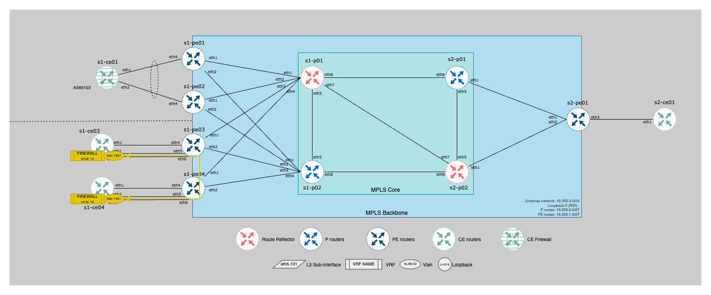

# Pseudowire (VPWS) Use case

## Overview

This lab covers a VPWS Pseudowire based on BGP control-plane:

- `Ethernet6` is a UNI interface towards `s1-ce03` on `s1-pe03`
- `Ethernet6` is a UNI interface towards `s1-ce04` on `s1-pe04`
- Vlan `1401` (10.4.1.0/24) is conefigured on ce devices using `VPWS` vrf.




## Technical details

### Connectivity

| CE node | CE interface         | IP address     | IP address      | PE interface   | PE node  |
|---------|----------------------|----------------|-----------------|----------------|----------|
|s1-ce03  | Vlan1401 / Ethernet3 | `10.4.1.13/24` | N/A             | Ethernet6      | s1-pe03  |


### Configuration information

- VRF Name: `VPWS` on CE devices
- IP address on CE devices: `10.4.1.0/24`
- Circuit definition:
    - peers: `s1-ce03` / `s1-ce04`
    - Local interface: Ethernet6
    - Remote interface: Ethernet6
    - route-target: `rt:14000:14000`

## Lab Scenario

### BGP route advertisement

```
s1-pe03#show bgp evpn rd 10.255.1.3:14000 detail
BGP routing table information for VRF default
Router identifier 10.255.1.3, local AS number 65000
BGP routing table entry for auto-discovery 3 0000:0000:0000:0000:0000, Route Distinguisher: 10.255.1.3:14000
 Paths: 1 available
  Local
    - from - (0.0.0.0)
      Origin IGP, metric -, localpref -, weight 0, tag 0, valid, local, best
      Extended Community: Route-Target-AS:14000:14000 TunnelEncap:tunnelTypeMpls L2 Attributes: control word
      MPLS label: 100000
```

### Patch Panel status

```
s1-pe04#show patch panel
Patch           Connector                                   Status Last Change
--------------- ------------------------------------------- ------ -----------
s1-ce03-s1-ce04 1: Ethernet6                                Up     0:01:01 ago
                2: BGP VPWS VPWS Pseudowire s1-ce03-s1-ce04

s1-pe04#show patch panel detail
PW Fault Legend:
   ET-IN - Ethernet receive fault
   ET-OUT - Ethernet transmit fault
   TUN-IN - Tunnel receive fault
   TUN-OUT - Tunnel transmit fault
   NF - Pseudowire not forwarding (other reason)

Patch: s1-ce03-s1-ce04, Status: Up, Last change: 0:01:24 ago
   Connector 1: Ethernet6
      Status: Up
      Error disable trigger: none
   Connector 2: BGP VPWS VPWS Pseudowire s1-ce03-s1-ce04
      Status: Up
      Local MPLS label: 100000
         MTU: 0, Control word: N
      Neighbor 10.255.1.3, MPLS label: 100000
         Tunnel type: IS-IS SR IPv4, Tunnel index: 2
         MTU: 0, Control word: Y
      EVPN VPWS type: port-based
      Flow label used: no
```

### LLDP status on CE node

```
s1-ce04#show lldp neighbors
Last table change time   : 0:13:45 ago
Number of table inserts  : 7
Number of table deletes  : 0
Number of table drops    : 0
Number of table age-outs : 0

Port          Neighbor Device ID       Neighbor Port ID    TTL
---------- ------------------------ ---------------------- ---
Et1           s1-pe04.atd.lab          Ethernet4           120
Et2           s1-pe04.atd.lab          Ethernet5           120
Et3           s1-ce03.atd.lab          Ethernet3           120
```
